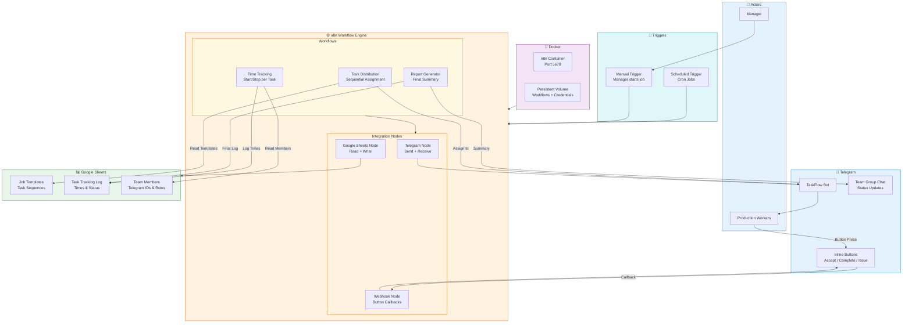

# Task Automation Architecture

## System Architecture

```mermaid
flowchart TB
    subgraph Actors["👥 Actors"]
        Manager[Manager]
        Workers[Production Workers]
    end

    subgraph Triggers["🎯 Triggers"]
        Manual[Manual Trigger<br/>Manager starts job]
        Schedule[Scheduled Trigger<br/>Cron Jobs]
    end

    subgraph N8N["⚙️ n8n Workflow Engine"]
        direction TB
        subgraph Workflows["Workflows"]
            TaskDist[Task Distribution<br/>Sequential Assignment]
            Tracking[Time Tracking<br/>Start/Stop per Task]
            Reporting[Report Generator<br/>Final Summary]
        end
        subgraph Nodes["Integration Nodes"]
            TelegramNode[Telegram Node<br/>Send + Receive]
            SheetsNode[Google Sheets Node<br/>Read + Write]
            WebhookNode[Webhook Node<br/>Button Callbacks]
        end
    end

    subgraph Telegram["📱 Telegram"]
        Bot[TaskFlow Bot]
        InlineButtons[Inline Buttons<br/>Accept / Complete / Issue]
        GroupChat[Team Group Chat<br/>Status Updates]
    end

    subgraph GSheets["📊 Google Sheets"]
        Templates[Job Templates<br/>Task Sequences]
        TaskLog[Task Tracking Log<br/>Times & Status]
        TeamDB[Team Members<br/>Telegram IDs & Roles]
    end

    subgraph Docker["🐳 Docker"]
        N8NContainer[n8n Container<br/>Port 5678]
        Volume[Persistent Volume<br/>Workflows + Credentials]
    end

    Manager --> Manual
    Schedule --> N8N
    Manual --> N8N

    Workflows --> Nodes
    TelegramNode --> Bot
    SheetsNode --> GSheets
    WebhookNode --> InlineButtons

    Bot --> Workers
    InlineButtons -->|Callback| WebhookNode
    Workers -->|Button Press| InlineButtons

    TaskDist -->|Read Templates| Templates
    TaskDist -->|Assign to| Bot
    Tracking -->|Log Times| TaskLog
    Tracking -->|Read Members| TeamDB
    Reporting -->|Summary| GroupChat
    Reporting -->|Final Log| TaskLog

    Docker --> N8N

    style Actors fill:#e3f2fd,stroke:#1565c0
    style Triggers fill:#e0f7fa,stroke:#00838f
    style N8N fill:#fff3e0,stroke:#e65100
    style Telegram fill:#e3f2fd,stroke:#0288d1
    style GSheets fill:#e8f5e9,stroke:#2e7d32
    style Docker fill:#f3e5f5,stroke:#7b1fa2
    style Workflows fill:#fff8e1,stroke:#f57f17
    style Nodes fill:#fff3e0,stroke:#ef6c00
```
