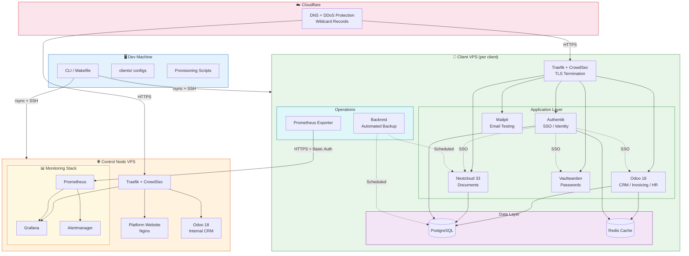

# BOS Platform Architecture

## System Architecture

```mermaid
flowchart TB
    subgraph DEV["🖥️ Dev Machine"]
        CLI[CLI / Makefile]
        Configs[clients/ configs]
        Scripts[Provisioning Scripts]
    end

    subgraph CTRL["🌐 Control Node VPS"]
        direction TB
        Traefik_Ctrl[Traefik + CrowdSec]
        Website[Platform Website<br/>Nginx]
        CRM_Ctrl[Odoo 18<br/>Internal CRM]
        subgraph Monitoring["📊 Monitoring Stack"]
            Grafana[Grafana]
            Prom_Ctrl[Prometheus]
            Alert[Alertmanager]
        end
    end

    subgraph CLIENT["🏢 Client VPS (per client)"]
        direction TB
        Traefik_C[Traefik + CrowdSec<br/>TLS Termination]
        subgraph Apps["Application Layer"]
            Auth[Authentik<br/>SSO / Identity]
            CRM_C[Odoo 18<br/>CRM / Invoicing / HR]
            Docs[Nextcloud 33<br/>Documents]
            Vault[Vaultwarden<br/>Passwords]
            Mail[Mailpit<br/>Email Testing]
        end
        subgraph Data["Data Layer"]
            DB[(PostgreSQL)]
            Redis[(Redis Cache)]
        end
        subgraph Ops["Operations"]
            Backup[Backrest<br/>Automated Backup]
            Metrics[Prometheus Exporter]
        end
    end

    subgraph DNS["☁️ Cloudflare"]
        CF[DNS + DDoS Protection<br/>Wildcard Records]
    end

    CLI -->|"rsync + SSH"| CTRL
    CLI -->|"rsync + SSH"| CLIENT
    CF -->|HTTPS| Traefik_Ctrl
    CF -->|HTTPS| Traefik_C

    Traefik_Ctrl --> Website
    Traefik_Ctrl --> CRM_Ctrl
    Traefik_Ctrl --> Grafana

    Traefik_C --> Auth
    Traefik_C --> CRM_C
    Traefik_C --> Docs
    Traefik_C --> Vault
    Traefik_C --> Mail

    Auth -.->|SSO| CRM_C
    Auth -.->|SSO| Docs
    Auth -.->|SSO| Vault

    CRM_C --> DB
    Docs --> DB
    Auth --> DB
    CRM_C --> Redis
    Auth --> Redis

    Metrics -->|"HTTPS + Basic Auth"| Prom_Ctrl
    Prom_Ctrl --> Alert
    Prom_Ctrl --> Grafana

    Backup -.->|"Scheduled"| DB
    Backup -.->|"Scheduled"| Docs

    style DEV fill:#e3f2fd,stroke:#1565c0
    style CTRL fill:#fff3e0,stroke:#e65100
    style CLIENT fill:#e8f5e9,stroke:#2e7d32
    style DNS fill:#fce4ec,stroke:#c62828
    style Monitoring fill:#fff8e1,stroke:#f57f17
    style Apps fill:#e8f5e9,stroke:#388e3c
    style Data fill:#f3e5f5,stroke:#7b1fa2
    style Ops fill:#e0f7fa,stroke:#00838f
```
