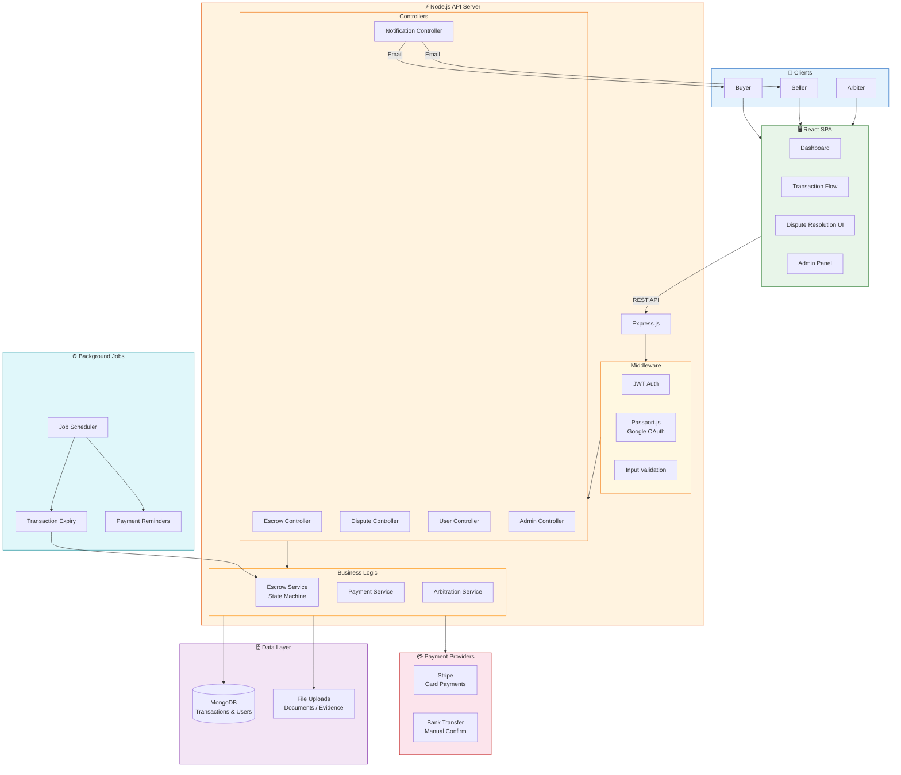

# Escroo Platform Architecture

## System Architecture

```mermaid
flowchart TB
    subgraph Clients["👥 Clients"]
        Buyer[Buyer]
        Seller[Seller]
        Arbiter[Arbiter]
    end

    subgraph Frontend["🖥️ React SPA"]
        Dashboard[Dashboard]
        TxFlow[Transaction Flow]
        DisputeUI[Dispute Resolution UI]
        AdminPanel[Admin Panel]
    end

    subgraph API["⚡ Node.js API Server"]
        direction TB
        Express[Express.js]
        subgraph Middleware["Middleware"]
            JWT[JWT Auth]
            Passport[Passport.js<br/>Google OAuth]
            Validator[Input Validation]
        end
        subgraph Controllers["Controllers"]
            EscrowCtrl[Escrow Controller]
            DisputeCtrl[Dispute Controller]
            UserCtrl[User Controller]
            NotifCtrl[Notification Controller]
            AdminCtrl[Admin Controller]
        end
        subgraph Services["Business Logic"]
            EscrowSvc[Escrow Service<br/>State Machine]
            PaymentSvc[Payment Service]
            ArbitrageSvc[Arbitration Service]
        end
    end

    subgraph Payments["💳 Payment Providers"]
        Stripe[Stripe<br/>Card Payments]
        BankTransfer[Bank Transfer<br/>Manual Confirm]
    end

    subgraph Storage["🗄️ Data Layer"]
        Mongo[(MongoDB<br/>Transactions & Users)]
        Uploads[File Uploads<br/>Documents / Evidence]
    end

    subgraph Jobs["⏰ Background Jobs"]
        Scheduler[Job Scheduler]
        Expiry[Transaction Expiry]
        Reminders[Payment Reminders]
    end

    Buyer --> Frontend
    Seller --> Frontend
    Arbiter --> Frontend
    Frontend -->|REST API| Express

    Express --> Middleware
    Middleware --> Controllers
    Controllers --> Services

    Services --> Mongo
    Services --> Payments
    Services --> Uploads
    NotifCtrl -->|Email| Buyer
    NotifCtrl -->|Email| Seller

    Scheduler --> Expiry
    Scheduler --> Reminders
    Expiry --> EscrowSvc

    style Clients fill:#e3f2fd,stroke:#1565c0
    style Frontend fill:#e8f5e9,stroke:#2e7d32
    style API fill:#fff3e0,stroke:#e65100
    style Payments fill:#fce4ec,stroke:#c62828
    style Storage fill:#f3e5f5,stroke:#7b1fa2
    style Jobs fill:#e0f7fa,stroke:#00838f
    style Middleware fill:#fff8e1,stroke:#f57f17
    style Controllers fill:#fff3e0,stroke:#ef6c00
    style Services fill:#fff3e0,stroke:#ff8f00
```
