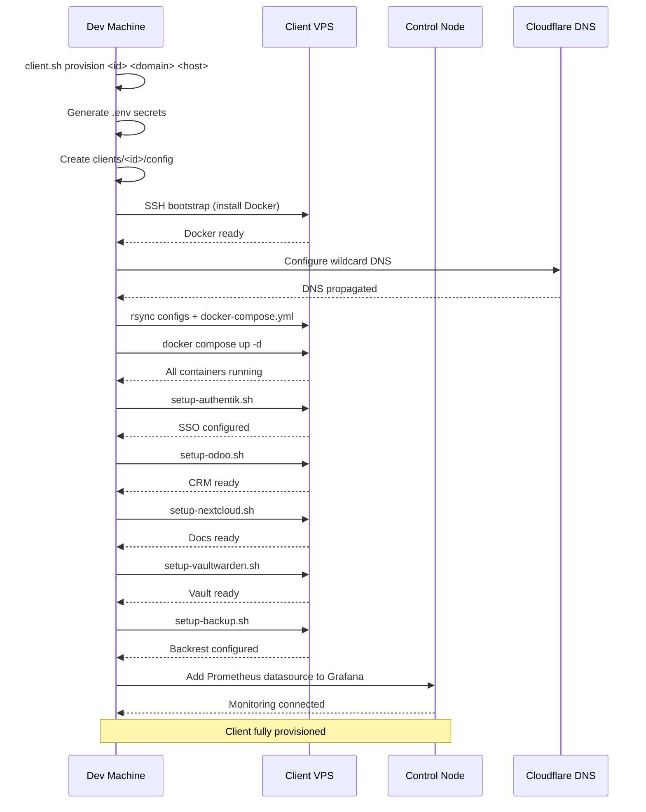

# Client Provisioning Flow

Sequence of operations when provisioning a new client VPS.

```mermaid
sequenceDiagram
    participant Dev as Dev Machine
    participant VPS as Client VPS
    participant Ctrl as Control Node
    participant CF as Cloudflare DNS

    Dev->>Dev: client.sh provision <id> <domain> <host>
    Dev->>Dev: Generate .env secrets
    Dev->>Dev: Create clients/<id>/config

    Dev->>VPS: SSH bootstrap (install Docker)
    VPS-->>Dev: Docker ready

    Dev->>CF: Configure wildcard DNS
    CF-->>Dev: DNS propagated

    Dev->>VPS: rsync configs + docker-compose.yml
    Dev->>VPS: docker compose up -d
    VPS-->>Dev: All containers running

    Dev->>VPS: setup-authentik.sh
    VPS-->>Dev: SSO configured

    Dev->>VPS: setup-odoo.sh
    VPS-->>Dev: CRM ready

    Dev->>VPS: setup-nextcloud.sh
    VPS-->>Dev: Docs ready

    Dev->>VPS: setup-vaultwarden.sh
    VPS-->>Dev: Vault ready

    Dev->>VPS: setup-backup.sh
    VPS-->>Dev: Backrest configured

    Dev->>Ctrl: Add Prometheus datasource to Grafana
    Ctrl-->>Dev: Monitoring connected

    Note over Dev,Ctrl: Client fully provisioned
```
