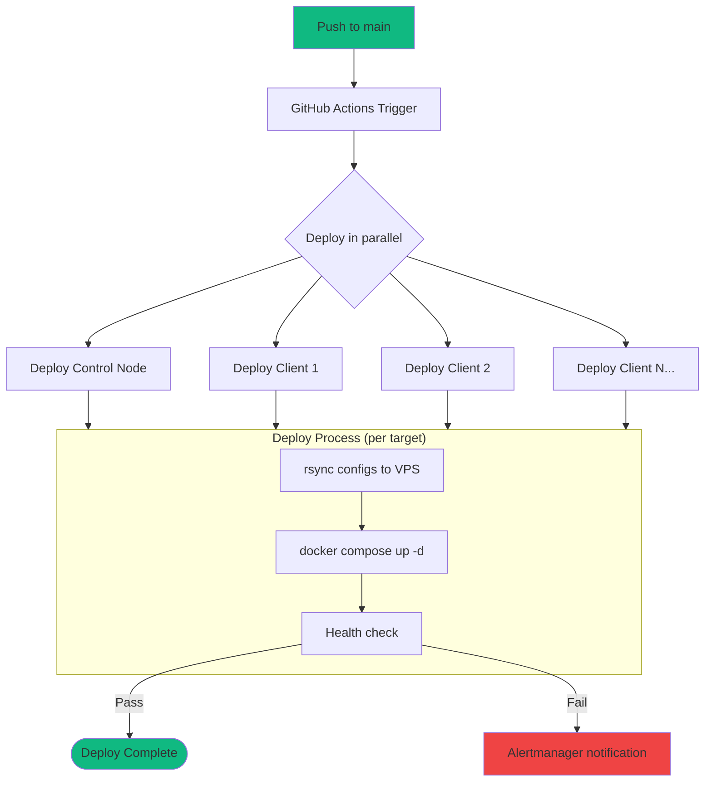

# Deployment Pipeline

CI/CD workflow for deploying updates to all clients.

```mermaid
flowchart TD
    Push[Push to main] --> GHA[GitHub Actions Trigger]
    
    GHA --> Parallel{Deploy in parallel}
    
    Parallel --> Ctrl[Deploy Control Node]
    Parallel --> C1[Deploy Client 1]
    Parallel --> C2[Deploy Client 2]
    Parallel --> CN[Deploy Client N...]
    
    subgraph deploy["Deploy Process (per target)"]
        Rsync[rsync configs to VPS]
        Compose[docker compose up -d]
        Health[Health check]
        
        Rsync --> Compose --> Health
    end
    
    Ctrl --> deploy
    C1 --> deploy
    C2 --> deploy
    CN --> deploy
    
    Health -->|Pass| Done([Deploy Complete])
    Health -->|Fail| Alert[Alertmanager notification]

    style Push fill:#10b981
    style Done fill:#10b981
    style Alert fill:#ef4444
```
