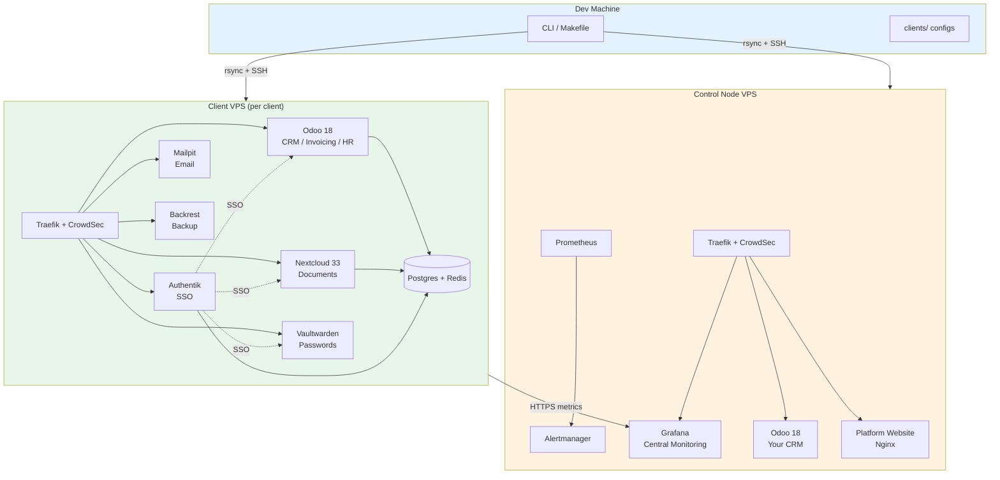

# Infrastructure Overview

High-level view of the BOS (Business Operating System) platform architecture.

```mermaid
flowchart TB
    subgraph DEV["Dev Machine"]
        CLI[CLI / Makefile]
        Configs[clients/ configs]
    end

    subgraph CTRL["Control Node VPS"]
        Website[Platform Website<br/>Nginx]
        CRM_Ctrl[Odoo 18<br/>Your CRM]
        Grafana[Grafana<br/>Central Monitoring]
        Prom_Ctrl[Prometheus]
        Alert[Alertmanager]
        Traefik_Ctrl[Traefik + CrowdSec]
    end

    subgraph CLIENT["Client VPS (per client)"]
        Traefik_C[Traefik + CrowdSec]
        Auth[Authentik<br/>SSO]
        CRM_C[Odoo 18<br/>CRM / Invoicing / HR]
        Docs[Nextcloud 33<br/>Documents]
        Vault[Vaultwarden<br/>Passwords]
        Mail[Mailpit<br/>Email]
        Backup[Backrest<br/>Backup]
        DB[(Postgres + Redis)]
    end

    CLI -->|rsync + SSH| CTRL
    CLI -->|rsync + SSH| CLIENT
    CLIENT -->|HTTPS metrics| Grafana
    Prom_Ctrl --> Alert

    Traefik_Ctrl --> Website
    Traefik_Ctrl --> CRM_Ctrl
    Traefik_Ctrl --> Grafana

    Traefik_C --> Auth
    Traefik_C --> CRM_C
    Traefik_C --> Docs
    Traefik_C --> Vault
    Traefik_C --> Mail
    Traefik_C --> Backup

    Auth -.->|SSO| CRM_C
    Auth -.->|SSO| Docs
    Auth -.->|SSO| Vault

    CRM_C --> DB
    Docs --> DB
    Auth --> DB

    style DEV fill:#e3f2fd
    style CTRL fill:#fff3e0
    style CLIENT fill:#e8f5e9
```
