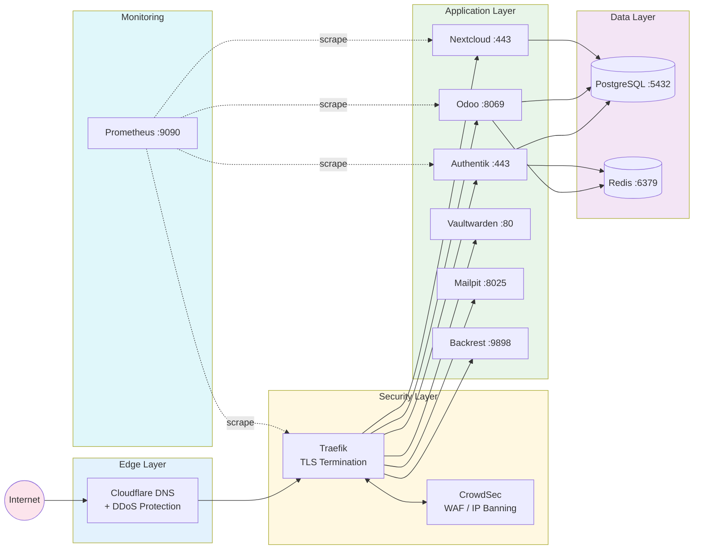

# Network Topology

Network security layers and traffic flow.

```mermaid
flowchart LR
    Internet((Internet))
    
    subgraph Edge["Edge Layer"]
        CF[Cloudflare DNS<br/>+ DDoS Protection]
    end
    
    subgraph Security["Security Layer"]
        Traefik[Traefik<br/>TLS Termination]
        CrowdSec[CrowdSec<br/>WAF / IP Banning]
    end
    
    subgraph Services["Application Layer"]
        Auth[Authentik :443]
        Odoo[Odoo :8069]
        NC[Nextcloud :443]
        VW[Vaultwarden :80]
        MP[Mailpit :8025]
        BR[Backrest :9898]
    end
    
    subgraph Data["Data Layer"]
        PG[(PostgreSQL :5432)]
        Redis[(Redis :6379)]
    end
    
    subgraph Monitoring["Monitoring"]
        Prom[Prometheus :9090]
    end
    
    Internet --> CF
    CF --> Traefik
    Traefik <--> CrowdSec
    
    Traefik --> Auth
    Traefik --> Odoo
    Traefik --> NC
    Traefik --> VW
    Traefik --> MP
    Traefik --> BR
    
    Auth --> PG
    Odoo --> PG
    NC --> PG
    Odoo --> Redis
    Auth --> Redis
    
    Prom -.->|scrape| Traefik
    Prom -.->|scrape| Auth
    Prom -.->|scrape| Odoo
    Prom -.->|scrape| NC

    style Internet fill:#fce4ec
    style Edge fill:#e3f2fd
    style Security fill:#fff8e1
    style Services fill:#e8f5e9
    style Data fill:#f3e5f5
    style Monitoring fill:#e0f7fa
```
