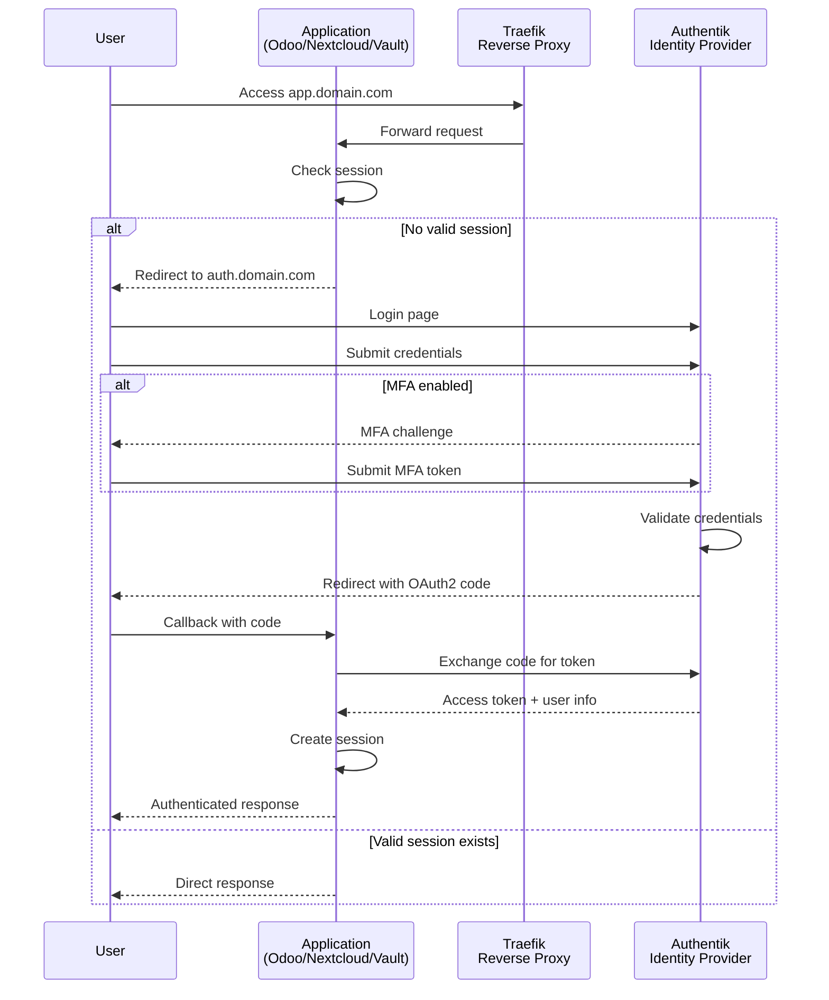

# SSO Authentication Flow

How Authentik provides single sign-on across all client services.

```mermaid
sequenceDiagram
    participant User
    participant App as Application<br/>(Odoo/Nextcloud/Vault)
    participant Traefik as Traefik<br/>Reverse Proxy
    participant Auth as Authentik<br/>Identity Provider

    User->>Traefik: Access app.domain.com
    Traefik->>App: Forward request
    App->>App: Check session
    
    alt No valid session
        App-->>User: Redirect to auth.domain.com
        User->>Auth: Login page
        User->>Auth: Submit credentials
        
        alt MFA enabled
            Auth-->>User: MFA challenge
            User->>Auth: Submit MFA token
        end
        
        Auth->>Auth: Validate credentials
        Auth-->>User: Redirect with OAuth2 code
        User->>App: Callback with code
        App->>Auth: Exchange code for token
        Auth-->>App: Access token + user info
        App->>App: Create session
        App-->>User: Authenticated response
    else Valid session exists
        App-->>User: Direct response
    end
```
