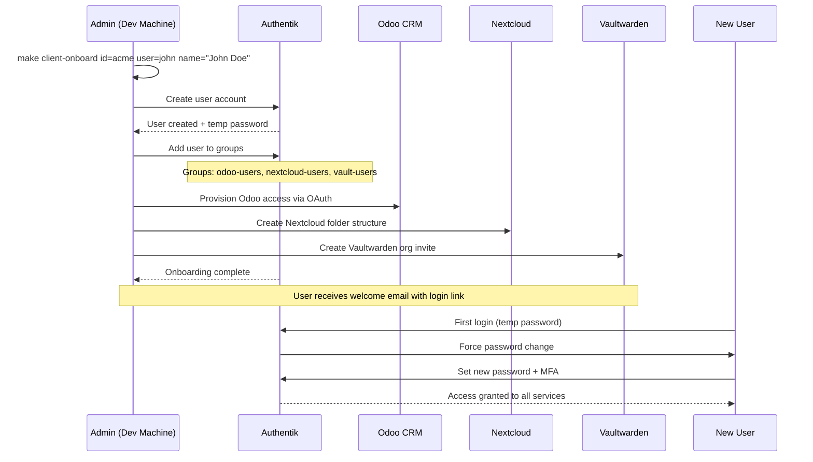

# User Onboarding

Process for onboarding a new user to a client's BOS instance.

```mermaid
sequenceDiagram
    participant Admin as Admin (Dev Machine)
    participant Auth as Authentik
    participant Odoo as Odoo CRM
    participant NC as Nextcloud
    participant VW as Vaultwarden

    Admin->>Admin: make client-onboard id=acme user=john name="John Doe"
    
    Admin->>Auth: Create user account
    Auth-->>Admin: User created + temp password
    
    Admin->>Auth: Add user to groups
    Note over Auth: Groups: odoo-users, nextcloud-users, vault-users
    
    Admin->>Odoo: Provision Odoo access via OAuth
    Admin->>NC: Create Nextcloud folder structure
    Admin->>VW: Create Vaultwarden org invite
    
    Auth-->>Admin: Onboarding complete
    
    Note over Admin,VW: User receives welcome email with login link
    
    participant User as New User
    User->>Auth: First login (temp password)
    Auth->>User: Force password change
    User->>Auth: Set new password + MFA
    Auth-->>User: Access granted to all services
```
