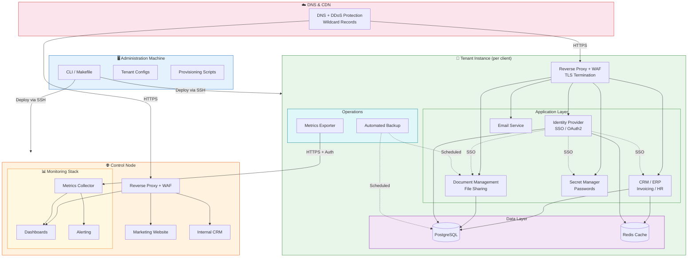

# Multi-Tenant SaaS Platform

## System Architecture

```mermaid
flowchart TB
    subgraph DEV["🖥️ Administration Machine"]
        CLI[CLI / Makefile]
        Configs[Tenant Configs]
        Scripts[Provisioning Scripts]
    end

    subgraph CTRL["🌐 Control Node"]
        direction TB
        Traefik_Ctrl[Reverse Proxy + WAF]
        Website[Marketing Website]
        CRM_Ctrl[Internal CRM]
        subgraph Monitoring["📊 Monitoring Stack"]
            Grafana[Dashboards]
            Prometheus[Metrics Collector]
            Alert[Alerting]
        end
    end

    subgraph TENANT["🏢 Tenant Instance (per client)"]
        direction TB
        Traefik_C[Reverse Proxy + WAF<br/>TLS Termination]
        subgraph Apps["Application Layer"]
            Auth[Identity Provider<br/>SSO / OAuth2]
            CRM[CRM / ERP<br/>Invoicing / HR]
            Docs[Document Management<br/>File Sharing]
            Vault[Secret Manager<br/>Passwords]
            Mail[Email Service]
        end
        subgraph Data["Data Layer"]
            DB[(PostgreSQL)]
            Redis[(Redis Cache)]
        end
        subgraph Ops["Operations"]
            Backup[Automated Backup]
            Metrics_T[Metrics Exporter]
        end
    end

    subgraph DNS["☁️ DNS & CDN"]
        CF[DNS + DDoS Protection<br/>Wildcard Records]
    end

    CLI -->|"Deploy via SSH"| CTRL
    CLI -->|"Deploy via SSH"| TENANT
    CF -->|HTTPS| Traefik_Ctrl
    CF -->|HTTPS| Traefik_C

    Traefik_Ctrl --> Website
    Traefik_Ctrl --> CRM_Ctrl
    Traefik_Ctrl --> Grafana

    Traefik_C --> Auth
    Traefik_C --> CRM
    Traefik_C --> Docs
    Traefik_C --> Vault
    Traefik_C --> Mail

    Auth -.->|SSO| CRM
    Auth -.->|SSO| Docs
    Auth -.->|SSO| Vault

    CRM --> DB
    Docs --> DB
    Auth --> DB
    CRM --> Redis
    Auth --> Redis

    Metrics_T -->|"HTTPS + Auth"| Prometheus
    Prometheus --> Alert
    Prometheus --> Grafana

    Backup -.->|"Scheduled"| DB
    Backup -.->|"Scheduled"| Docs

    style DEV fill:#e3f2fd,stroke:#1565c0
    style CTRL fill:#fff3e0,stroke:#e65100
    style TENANT fill:#e8f5e9,stroke:#2e7d32
    style DNS fill:#fce4ec,stroke:#c62828
    style Monitoring fill:#fff8e1,stroke:#f57f17
    style Apps fill:#e8f5e9,stroke:#388e3c
    style Data fill:#f3e5f5,stroke:#7b1fa2
    style Ops fill:#e0f7fa,stroke:#00838f
```
