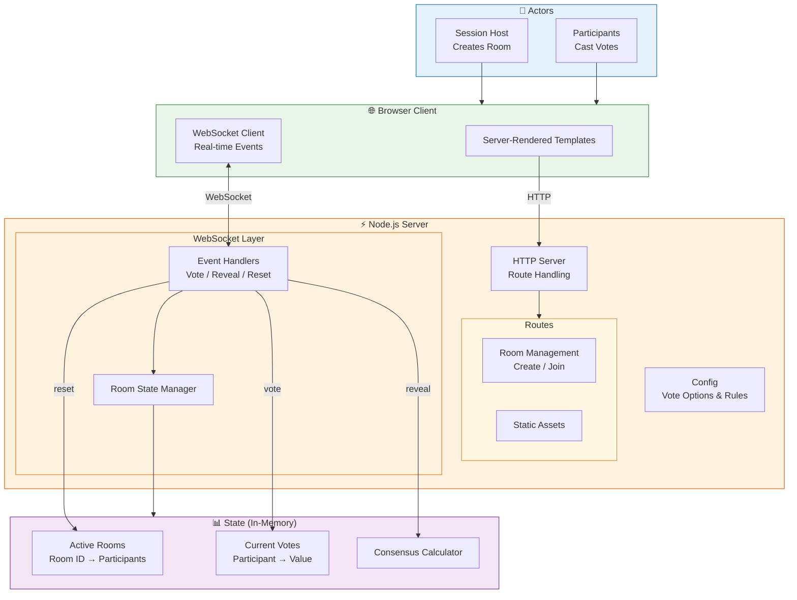

# Real-Time Voting App

## System Architecture

```mermaid
flowchart TB
    subgraph Actors["👥 Actors"]
        Host[Session Host<br/>Creates Room]
        Participants[Participants<br/>Cast Votes]
    end

    subgraph Browser["🌐 Browser Client"]
        Views[Server-Rendered Templates]
        SocketClient[WebSocket Client<br/>Real-time Events]
    end

    subgraph Server["⚡ Node.js Server"]
        HTTP[HTTP Server<br/>Route Handling]
        subgraph Routes["Routes"]
            RoomRoutes[Room Management<br/>Create / Join]
            StaticRoutes[Static Assets]
        end
        subgraph Realtime["WebSocket Layer"]
            SocketHandlers[Event Handlers<br/>Vote / Reveal / Reset]
            RoomState[Room State Manager]
        end
        Config[Config<br/>Vote Options & Rules]
    end

    subgraph State["📊 State (In-Memory)"]
        Rooms[Active Rooms<br/>Room ID → Participants]
        Votes[Current Votes<br/>Participant → Value]
        Consensus[Consensus Calculator]
    end

    Host --> Browser
    Participants --> Browser

    Views -->|HTTP| HTTP
    SocketClient <-->|WebSocket| SocketHandlers

    HTTP --> Routes
    SocketHandlers --> RoomState
    RoomState --> State

    SocketHandlers -->|"vote"| Votes
    SocketHandlers -->|"reveal"| Consensus
    SocketHandlers -->|"reset"| Rooms

    style Actors fill:#e3f2fd,stroke:#1565c0
    style Browser fill:#e8f5e9,stroke:#2e7d32
    style Server fill:#fff3e0,stroke:#e65100
    style State fill:#f3e5f5,stroke:#7b1fa2
    style Routes fill:#fff8e1,stroke:#f57f17
    style Realtime fill:#fff3e0,stroke:#ef6c00
```
