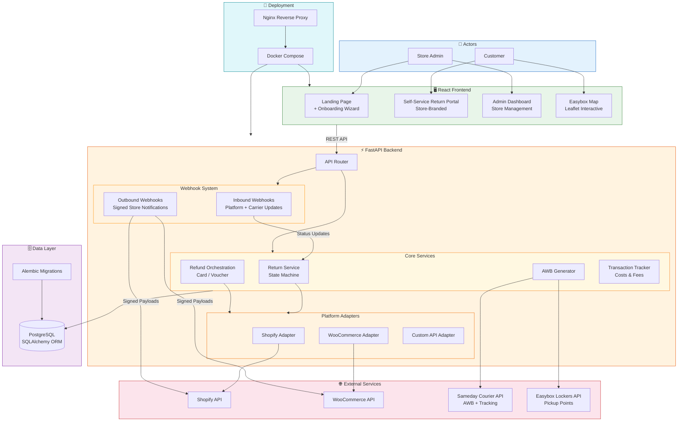

# Retur.ro Platform Architecture

## System Architecture

```mermaid
flowchart TB
    subgraph Actors["👥 Actors"]
        Customer[Customer]
        StoreAdmin[Store Admin]
    end

    subgraph Frontend["🖥️ React Frontend"]
        Landing[Landing Page<br/>+ Onboarding Wizard]
        ReturnPortal[Self-Service Return Portal<br/>Store-Branded]
        AdminDash[Admin Dashboard<br/>Store Management]
        MapView[Easybox Map<br/>Leaflet Interactive]
    end

    subgraph API["⚡ FastAPI Backend"]
        direction TB
        Router[API Router]
        subgraph Core["Core Services"]
            ReturnSvc[Return Service<br/>State Machine]
            RefundSvc[Refund Orchestration<br/>Card / Voucher]
            AWBSvc[AWB Generator]
            TxTracker[Transaction Tracker<br/>Costs & Fees]
        end
        subgraph Adapters["Platform Adapters"]
            Shopify[Shopify Adapter]
            Woo[WooCommerce Adapter]
            CustomAPI[Custom API Adapter]
        end
        subgraph Webhooks["Webhook System"]
            InboundWH[Inbound Webhooks<br/>Platform + Carrier Updates]
            OutboundWH[Outbound Webhooks<br/>Signed Store Notifications]
        end
    end

    subgraph External["🌐 External Services"]
        ShopifyAPI[Shopify API]
        WooAPI[WooCommerce API]
        Sameday[Sameday Courier API<br/>AWB + Tracking]
        Easybox[Easybox Lockers API<br/>Pickup Points]
    end

    subgraph Data["🗄️ Data Layer"]
        DB[(PostgreSQL<br/>SQLAlchemy ORM)]
        Alembic[Alembic Migrations]
    end

    subgraph Deploy["🐳 Deployment"]
        Docker[Docker Compose]
        Nginx[Nginx Reverse Proxy]
    end

    Customer --> ReturnPortal
    Customer --> MapView
    StoreAdmin --> AdminDash
    StoreAdmin --> Landing

    Frontend -->|REST API| Router
    Router --> Core
    Router --> Webhooks

    ReturnSvc --> Adapters
    AWBSvc --> Sameday
    AWBSvc --> Easybox
    RefundSvc --> Adapters

    Shopify --> ShopifyAPI
    Woo --> WooAPI

    InboundWH -->|Status Updates| ReturnSvc
    OutboundWH -->|Signed Payloads| ShopifyAPI
    OutboundWH -->|Signed Payloads| WooAPI

    Core --> DB
    Alembic --> DB

    Docker --> API
    Docker --> Frontend
    Nginx --> Docker

    style Actors fill:#e3f2fd,stroke:#1565c0
    style Frontend fill:#e8f5e9,stroke:#2e7d32
    style API fill:#fff3e0,stroke:#e65100
    style External fill:#fce4ec,stroke:#c62828
    style Data fill:#f3e5f5,stroke:#7b1fa2
    style Deploy fill:#e0f7fa,stroke:#00838f
    style Core fill:#fff8e1,stroke:#f57f17
    style Adapters fill:#fff3e0,stroke:#ef6c00
    style Webhooks fill:#fff3e0,stroke:#ff8f00
```
