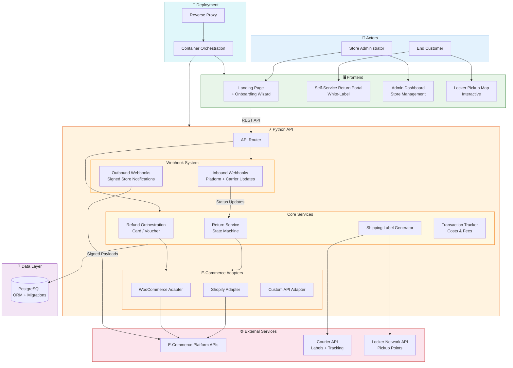

# Return Management SaaS

## System Architecture

```mermaid
flowchart TB
    subgraph Actors["👥 Actors"]
        Customer[End Customer]
        StoreAdmin[Store Administrator]
    end

    subgraph Frontend["🖥️ Frontend"]
        Landing[Landing Page<br/>+ Onboarding Wizard]
        ReturnPortal[Self-Service Return Portal<br/>White-Label]
        AdminDash[Admin Dashboard<br/>Store Management]
        MapView[Locker Pickup Map<br/>Interactive]
    end

    subgraph API["⚡ Python API"]
        direction TB
        Router[API Router]
        subgraph Core["Core Services"]
            ReturnSvc[Return Service<br/>State Machine]
            RefundSvc[Refund Orchestration<br/>Card / Voucher]
            AWBSvc[Shipping Label Generator]
            TxTracker[Transaction Tracker<br/>Costs & Fees]
        end
        subgraph Adapters["E-Commerce Adapters"]
            ShopifyAdpt[Shopify Adapter]
            WooAdpt[WooCommerce Adapter]
            CustomAdpt[Custom API Adapter]
        end
        subgraph Webhooks["Webhook System"]
            InboundWH[Inbound Webhooks<br/>Platform + Carrier Updates]
            OutboundWH[Outbound Webhooks<br/>Signed Store Notifications]
        end
    end

    subgraph External["🌐 External Services"]
        EcommAPI[E-Commerce Platform APIs]
        CourierAPI[Courier API<br/>Labels + Tracking]
        LockerAPI[Locker Network API<br/>Pickup Points]
    end

    subgraph Data["🗄️ Data Layer"]
        DB[(PostgreSQL<br/>ORM + Migrations)]
    end

    subgraph Deploy["🐳 Deployment"]
        Docker[Container Orchestration]
        Proxy[Reverse Proxy]
    end

    Customer --> ReturnPortal
    Customer --> MapView
    StoreAdmin --> AdminDash
    StoreAdmin --> Landing

    Frontend -->|REST API| Router
    Router --> Core
    Router --> Webhooks

    ReturnSvc --> Adapters
    AWBSvc --> CourierAPI
    AWBSvc --> LockerAPI
    RefundSvc --> Adapters

    ShopifyAdpt --> EcommAPI
    WooAdpt --> EcommAPI

    InboundWH -->|Status Updates| ReturnSvc
    OutboundWH -->|Signed Payloads| EcommAPI

    Core --> DB

    Docker --> API
    Docker --> Frontend
    Proxy --> Docker

    style Actors fill:#e3f2fd,stroke:#1565c0
    style Frontend fill:#e8f5e9,stroke:#2e7d32
    style API fill:#fff3e0,stroke:#e65100
    style External fill:#fce4ec,stroke:#c62828
    style Data fill:#f3e5f5,stroke:#7b1fa2
    style Deploy fill:#e0f7fa,stroke:#00838f
    style Core fill:#fff8e1,stroke:#f57f17
    style Adapters fill:#fff3e0,stroke:#ef6c00
    style Webhooks fill:#fff3e0,stroke:#ff8f00
```
