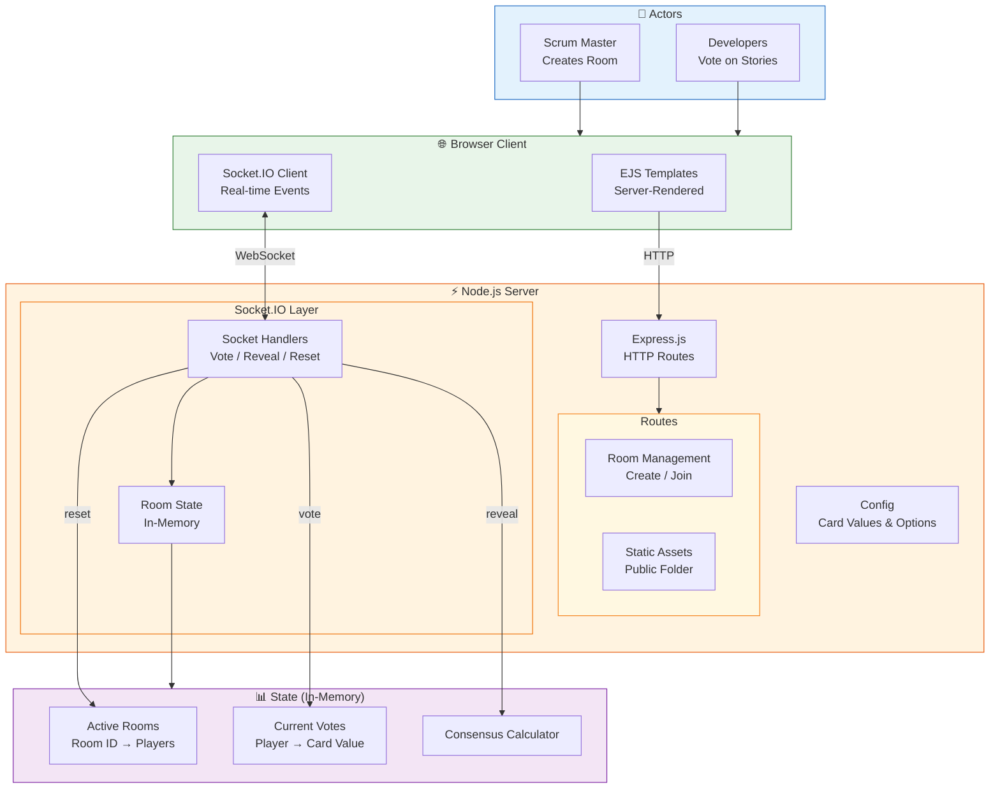

# Scrum Poker Architecture

## System Architecture

```mermaid
flowchart TB
    subgraph Actors["👥 Actors"]
        ScrumMaster[Scrum Master<br/>Creates Room]
        Devs[Developers<br/>Vote on Stories]
    end

    subgraph Browser["🌐 Browser Client"]
        Views[EJS Templates<br/>Server-Rendered]
        SocketClient[Socket.IO Client<br/>Real-time Events]
    end

    subgraph Server["⚡ Node.js Server"]
        Express[Express.js<br/>HTTP Routes]
        subgraph Routes["Routes"]
            RoomRoutes[Room Management<br/>Create / Join]
            StaticRoutes[Static Assets<br/>Public Folder]
        end
        subgraph Realtime["Socket.IO Layer"]
            SocketHandlers[Socket Handlers<br/>Vote / Reveal / Reset]
            RoomState[Room State<br/>In-Memory]
        end
        Config[Config<br/>Card Values & Options]
    end

    subgraph State["📊 State (In-Memory)"]
        Rooms[Active Rooms<br/>Room ID → Players]
        Votes[Current Votes<br/>Player → Card Value]
        Consensus[Consensus Calculator]
    end

    ScrumMaster --> Browser
    Devs --> Browser

    Views -->|HTTP| Express
    SocketClient <-->|WebSocket| SocketHandlers

    Express --> Routes
    SocketHandlers --> RoomState
    RoomState --> State

    SocketHandlers -->|"vote"| Votes
    SocketHandlers -->|"reveal"| Consensus
    SocketHandlers -->|"reset"| Rooms

    style Actors fill:#e3f2fd,stroke:#1565c0
    style Browser fill:#e8f5e9,stroke:#2e7d32
    style Server fill:#fff3e0,stroke:#e65100
    style State fill:#f3e5f5,stroke:#7b1fa2
    style Routes fill:#fff8e1,stroke:#f57f17
    style Realtime fill:#fff3e0,stroke:#ef6c00
```
