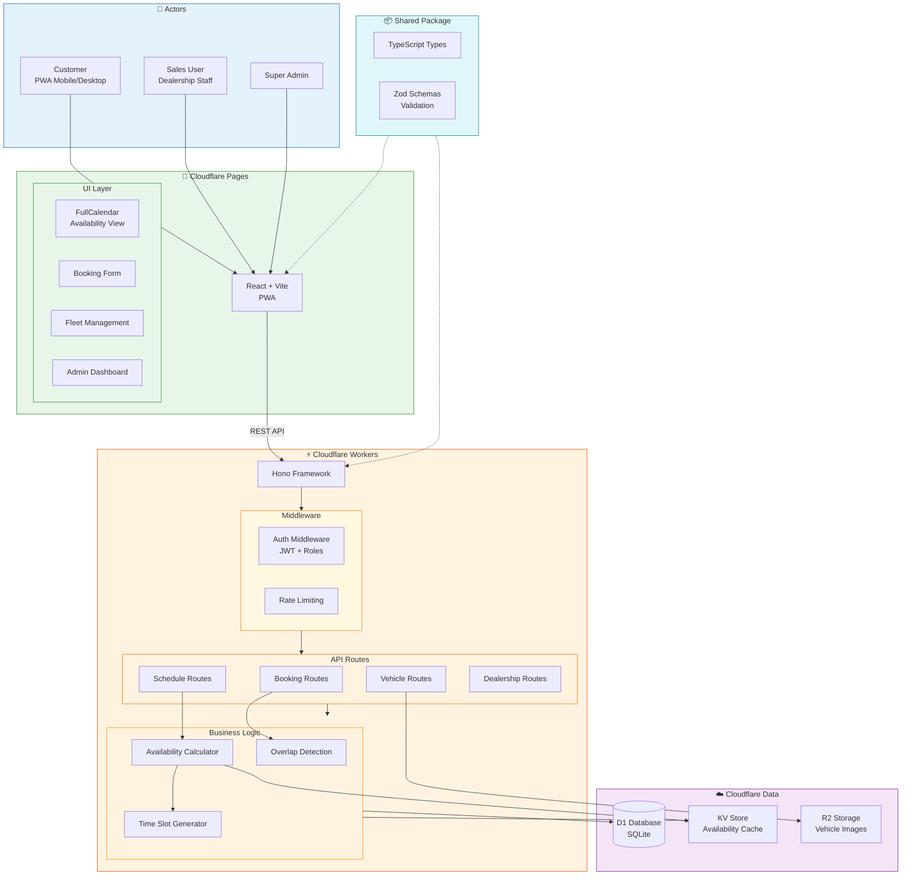

# Test Drive Booking Architecture

## System Architecture

```mermaid
flowchart TB
    subgraph Actors["👥 Actors"]
        Customer[Customer<br/>PWA Mobile/Desktop]
        Sales[Sales User<br/>Dealership Staff]
        SuperAdmin[Super Admin]
    end

    subgraph CloudflareFrontend["📱 Cloudflare Pages"]
        ReactApp[React + Vite<br/>PWA]
        subgraph UI["UI Layer"]
            Calendar[FullCalendar<br/>Availability View]
            BookingForm[Booking Form]
            FleetMgmt[Fleet Management]
            AdminUI[Admin Dashboard]
        end
    end

    subgraph CloudflareAPI["⚡ Cloudflare Workers"]
        Hono[Hono Framework]
        subgraph MW["Middleware"]
            AuthMW[Auth Middleware<br/>JWT + Roles]
            RateLimit[Rate Limiting]
        end
        subgraph Routes["API Routes"]
            BookingRoutes[Booking Routes]
            VehicleRoutes[Vehicle Routes]
            ScheduleRoutes[Schedule Routes]
            DealerRoutes[Dealership Routes]
        end
        subgraph Logic["Business Logic"]
            AvailCalc[Availability Calculator]
            ConflictCheck[Overlap Detection]
            SlotGen[Time Slot Generator]
        end
    end

    subgraph CloudflareData["☁️ Cloudflare Data"]
        D1[(D1 Database<br/>SQLite)]
        KV[KV Store<br/>Availability Cache]
        R2[R2 Storage<br/>Vehicle Images]
    end

    subgraph Shared["📦 Shared Package"]
        Types[TypeScript Types]
        Schemas[Zod Schemas<br/>Validation]
    end

    Customer --> ReactApp
    Sales --> ReactApp
    SuperAdmin --> ReactApp

    ReactApp -->|REST API| Hono
    Hono --> MW --> Routes
    Routes --> Logic

    Logic --> D1
    Logic --> KV
    BookingRoutes --> ConflictCheck
    ScheduleRoutes --> AvailCalc
    AvailCalc --> SlotGen

    VehicleRoutes --> R2
    AvailCalc --> KV

    Shared -.-> ReactApp
    Shared -.-> Hono

    style Actors fill:#e3f2fd,stroke:#1565c0
    style CloudflareFrontend fill:#e8f5e9,stroke:#2e7d32
    style CloudflareAPI fill:#fff3e0,stroke:#e65100
    style CloudflareData fill:#f3e5f5,stroke:#7b1fa2
    style Shared fill:#e0f7fa,stroke:#00838f
    style UI fill:#e8f5e9,stroke:#388e3c
    style MW fill:#fff8e1,stroke:#f57f17
    style Routes fill:#fff3e0,stroke:#ef6c00
    style Logic fill:#fff3e0,stroke:#ff8f00
```
