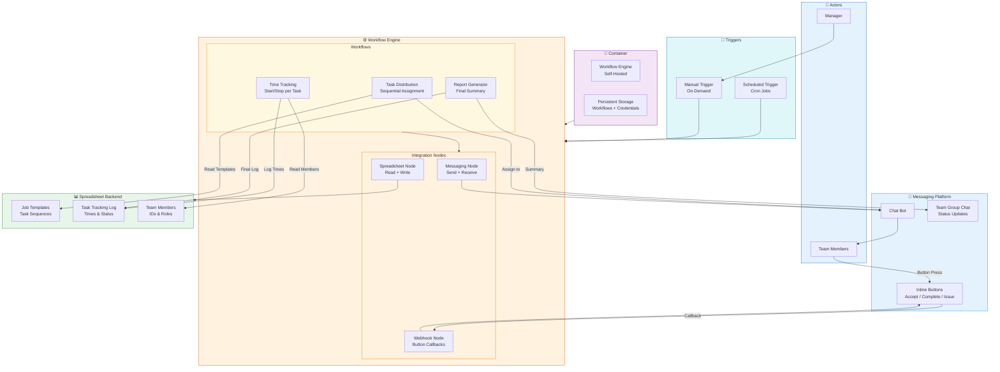

# Workflow Automation Engine

## System Architecture

```mermaid
flowchart TB
    subgraph Actors["👥 Actors"]
        Manager[Manager]
        Workers[Team Members]
    end

    subgraph Triggers["🎯 Triggers"]
        Manual[Manual Trigger<br/>On-Demand]
        Schedule[Scheduled Trigger<br/>Cron Jobs]
    end

    subgraph Engine["⚙️ Workflow Engine"]
        direction TB
        subgraph Workflows["Workflows"]
            TaskDist[Task Distribution<br/>Sequential Assignment]
            Tracking[Time Tracking<br/>Start/Stop per Task]
            Reporting[Report Generator<br/>Final Summary]
        end
        subgraph Nodes["Integration Nodes"]
            MessagingNode[Messaging Node<br/>Send + Receive]
            SpreadsheetNode[Spreadsheet Node<br/>Read + Write]
            WebhookNode[Webhook Node<br/>Button Callbacks]
        end
    end

    subgraph Messaging["📱 Messaging Platform"]
        Bot[Chat Bot]
        InlineButtons[Inline Buttons<br/>Accept / Complete / Issue]
        GroupChat[Team Group Chat<br/>Status Updates]
    end

    subgraph Spreadsheets["📊 Spreadsheet Backend"]
        Templates[Job Templates<br/>Task Sequences]
        TaskLog[Task Tracking Log<br/>Times & Status]
        TeamDB[Team Members<br/>IDs & Roles]
    end

    subgraph Container["🐳 Container"]
        EngineContainer[Workflow Engine<br/>Self-Hosted]
        Volume[Persistent Storage<br/>Workflows + Credentials]
    end

    Manager --> Manual
    Schedule --> Engine
    Manual --> Engine

    Workflows --> Nodes
    MessagingNode --> Bot
    SpreadsheetNode --> Spreadsheets
    WebhookNode --> InlineButtons

    Bot --> Workers
    InlineButtons -->|Callback| WebhookNode
    Workers -->|Button Press| InlineButtons

    TaskDist -->|Read Templates| Templates
    TaskDist -->|Assign to| Bot
    Tracking -->|Log Times| TaskLog
    Tracking -->|Read Members| TeamDB
    Reporting -->|Summary| GroupChat
    Reporting -->|Final Log| TaskLog

    Container --> Engine

    style Actors fill:#e3f2fd,stroke:#1565c0
    style Triggers fill:#e0f7fa,stroke:#00838f
    style Engine fill:#fff3e0,stroke:#e65100
    style Messaging fill:#e3f2fd,stroke:#0288d1
    style Spreadsheets fill:#e8f5e9,stroke:#2e7d32
    style Container fill:#f3e5f5,stroke:#7b1fa2
    style Workflows fill:#fff8e1,stroke:#f57f17
    style Nodes fill:#fff3e0,stroke:#ef6c00
```
